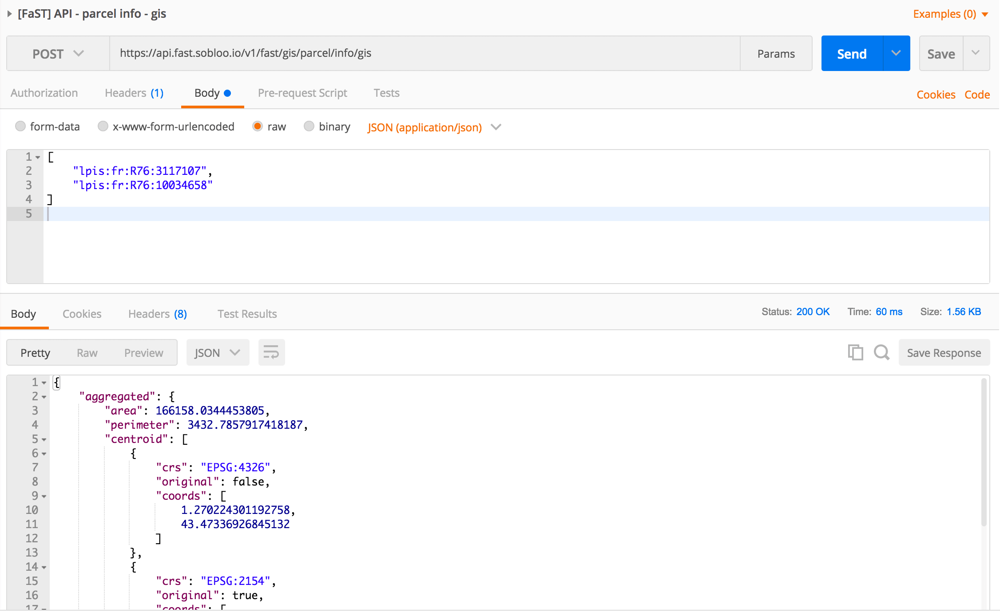

# FaST parcel-info API

The **FaST parcel-info API** exposes services to process common and specialized informations for a parcel (e.g. area, centroid, etc ...) or a collection of parcels. Specialized GIS microservices were developed using the Nuclio serverless framework. Calls to theses microservices are orchestrated by a central Node.js application which manages the distributed and non-blocking parts to enable good performance when processing a collection of parcels.

All theses microservices are natively scalable and highly available.

## Install & deployment

### Docker

The actions of building, tagging and publishing Docker images can be performed using the provided Makefiles.

For the Node.js webapp and each services in the ```gis-services``` directory, execute the following bash commands:
1. ```make build``` to build the container image
2. ```make tag``` to tag the newly built container image
3. ```make publish``` to publish the container image on your own Docker repository.

The repository, name and tag of each Docker container image can be overridden using the environment variables DOCKER_REPO, IMAGE_NAME and IMAGE_TAG:
```bash
$> cd webapp
$> make DOCKER_REPO=index.docker.io IMAGE_NAME=eufast/parcel-info-360 IMAGE_TAG=0.1.0 tag
```

### Kubernetes

A basic configuration is provided and works as is for each services. Don't forget to update the configuration according to your environment (ex: the number of replicas, docker images and ingress settings).

To deploy the parcel-info API on Kubernetes, apply the YAML manifests of each services:

Node.js webapp:
```bash
$> kubectl create -f .
```

GIS services (ex: geojson2gisinfo) 
```bash
$> cd gis-services/geojson2gisinfo
$> kubectl create -f .
```

Then check the status of Kubernetes pods:

```bash
$> kubectl -n fast-platform get pod -l module=core,domain=gis,api=parcel-info

NAME                                               READY     STATUS    RESTARTS   AGE
parcel-info-360-784945c96b-64bjz                   1/1       Running   0          6m
parcel-info-360-784945c96b-fmkjb                   1/1       Running   0          6m
parcel-info-geojson2gisinfo-c4fc69cd9-nf9tq        1/1       Running   0          4m
parcel-info-geojson2gisinfo-c4fc69cd9-svv7j        1/1       Running   0          4m
parcel-info-geojson2hydroinfo-655fc6c744-gxxhf     1/1       Running   0          4m
parcel-info-geojson2hydroinfo-655fc6c744-mrg6v     1/1       Running   0          4m
parcel-info-geojson2naturainfo-84d4db7d9d-8r8nt    1/1       Running   0          4m
parcel-info-geojson2naturainfo-84d4db7d9d-wbzvs    1/1       Running   0          4m
parcel-info-geojson2socinfo-5885d7b584-c79x4       1/1       Running   0          4m
parcel-info-geojson2socinfo-5885d7b584-k6d5b       1/1       Running   0          4m
parcel-info-geojson2topsoilinfo-674d567b88-brf4f   1/1       Running   0          2m
parcel-info-geojson2topsoilinfo-674d567b88-mdq5d   1/1       Running   0          2m
```

## Demo

